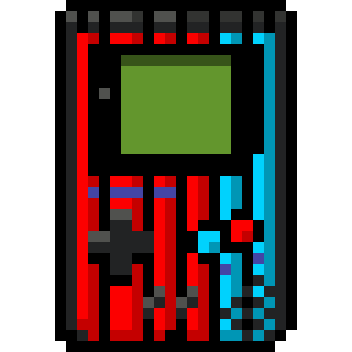

<p align="center">
  
</p>

<p align="center">
  <a href="https://buymeacoffee.com/rockmizx">
    
  </a>
</p>

# Allagan Retro Pocket

Allagan Retro Pocket is a multi-system Libretro frontend that runs inside FINAL FANTASY XIV through Dalamud. It keeps a local game library and provides controller support, per-system settings, save states, memory-card saves, firmware management and quick gameplay controls.
<p align="center">
  
</p>

## Installation

Open Dalamud Settings with `/xlsettings`, select **Experimental** and add this address under **Custom Plugin Repositories**:


```text
https://raw.githubusercontent.com/rockerudon/AllaganRetroPocket/main/repo.json
```

Enable the repository, save the settings, open `/xlplugins` and search for **Allagan Retro Pocket**.

## Command

```text
/retro
```

This is the only chat command registered by the plugin. The main window can also be opened from Dalamud's plugin installer.

## Library and settings

Games can be added individually or by scanning a folder. Removing a game from the library does not delete the original file.

Settings are stored per system. Available options depend on the selected Libretro core and include input bindings, video, audio, speed, save data, firmware and media controls.
<p align="center">
  
</p>

## License

Allagan Retro Pocket is distributed under the GNU Affero General Public License version 3 or later. See `LICENSE.md`, `NOTICE` and `THIRD-PARTY-NOTICES.md`.
